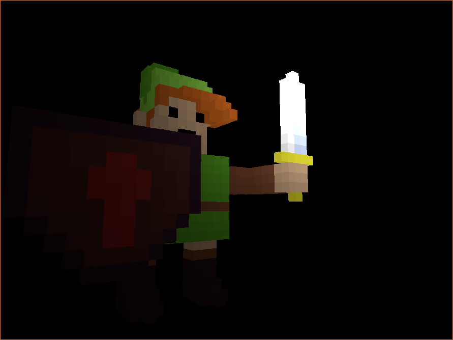

# Janus Renderer

This is a rendering engine I have been working on. I initially intended it to render voxel
models in a retro-like style. I wanted shading to be computed per voxel and have some kind
of palleted color scheme and dithering so that it would be reminiscent of pixel art scenes.

Although the initial version of this was more specialized for voxel rendering. I have
currently settled on a mostly standard deferred renderer that has the first pass mess
with the position buffer to make each voxel shaded from the same point in the second pass.
I may play with a more specialized approach in the future again, since lighting is still
computed per pixel even though it is only shown per voxel.

## TODO

- [ ] Real lighting system (light is currently hardcoded)
- [ ] Material system
- [ ] Ramped/palleted lighting
- [ ] dithered lighting (IDK if this will look good)
- [ ] Better meshing/loading (current method is not great)

